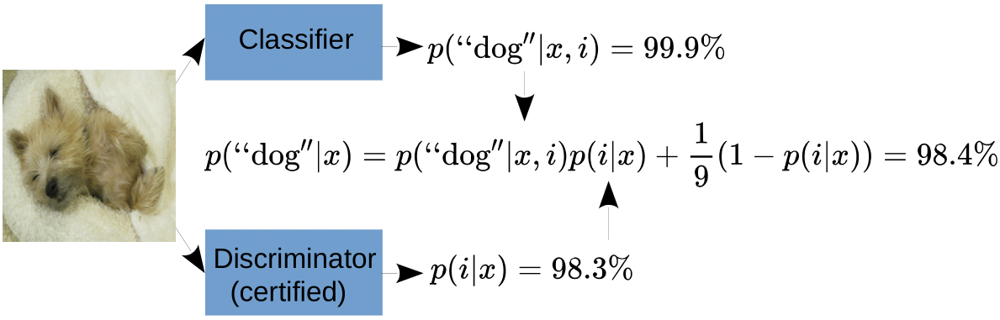

# Provably Robust Detection of Out-of-distribution Data (almost) for free


<p align="center"></p>

This repo contains the code that accompanies our NeurIPS 2022 paper [Provably Robust Detection of Out-of-distribution Data (almost) for free](https://arxiv.org/abs/2106.04260). We give both local as well as global guarantees that a classifier makes low-confidence predictions on out-of-distribution data. And here's the kicker: you can get these guarantees without loosing performance on either classification or clean OOD performance. We do this by splitting the work between a provable binary discriminator between in- and out-distribution and an off-the-shelf classifier. 

## Configuration
Install requirements (honestly, they are likely pretty overkill).
```
pip install -r requirements.txt
```

Configure the paths to your datasets within **paths_config.py**. If you want to configure different test out-distributions, please do so in the **val_loader_out_dicts** under **utils/dataloaders/dataloading.py**.

## Training
All training is using the **train_ProoD.py** function with the hyperparameters being managed with [hydra](https://github.com/facebookresearch/hydra). We show code for plain training, [OE](https://arxiv.org/abs/1812.04606) and our Prood-Disc on CIFAR10:
```
python train_ProoD.py gpu=0 experimental=plain dataset=CIFAR10 train.train_type=plain 
python train_ProoD.py gpu=0 experimental=plain dataset=CIFAR10 train.train_type=oe 
python train_ProoD.py gpu=0 experimental=schedule_long dataset=CIFAR10
```
For Restricted ImageNet use **experimental=schedule** for training the binary discriminator. When a model is trained to completion it automatically gets registered in a json file in the evals/ folder. Specifically, all hyperparameters are saved and the location of the final weights is saved. These json files are managed using [TinyDB](https://github.com/msiemens/tinydb). When running semi-joint training you have to provide the doc_id of the binary discriminator that you wish to use. For example, using doc_id=1 and a bias shift of 3:
```
python train_ProoD.py gpu=0 experimental=joint dataset=CIFAR10 train.train_type=oe architecture.detector_path=1 architecture.bias_shift=3
```

## Evaluation
All models (trained on a single GPU) are evaluated automatically after training. If you have unevaluated models registered in the TinyDB database you can evaluate them by running
```
python gen_eval.py --gpu 0 --dataset CIFAR10 --doc_id 1
```
The evaluations are saved under the same database entry that the model is loaded from. If you want to register a model in the database that was not trained in the pipeline you have to do so manually by providing architecture args that can be understood by **utils/factories.py** and **utils/eval_pipeline.py** (adavanced usage).

For the experiments in Appendix B you can run
```
python gen_eval.py --gpu 0 --dataset CIFAR10 --disc_id 1 --class_id 2 --bias_shift 3
```
which registers a new model in the database that consists of a discriminator (loaded from doc_id=1) and a classifier (with doc_id=2) and combines them under a bias shift of 3. This new model then automatically gets evaluated.

## Pre-Trained Models
The databases come pre-configured with the models shown in Table 2 in the paper. The pre-trained weights can be found [here](https://nc.mlcloud.uni-tuebingen.de/index.php/s/A8XMkLR4BPwLcej). Some weights are taken directly from [ATOM](https://github.com/jfc43/informative-outlier-mining) or [GOOD](https://github.com/j-cb/GOOD) and just rehosted here for convenience. Put them under **models/&lt;dataset&gt;/&lt;name&gt;.pt** or reconfigure **args.architecture.file_path** in the respective database in order to use them. You can conveniently load models by using the function **utils.model_zoo.from_database**.


## Cite Us

```
@inproceedings{meinke2022provably,
  title={Provably Robust Detection of Out-of-distribution Data (almost) for free},
  author={Meinke, Alexander and Bitterwolf, Julian and Hein, Matthias},
  booktitle={NeurIPS},
  year={2021}
}
```
